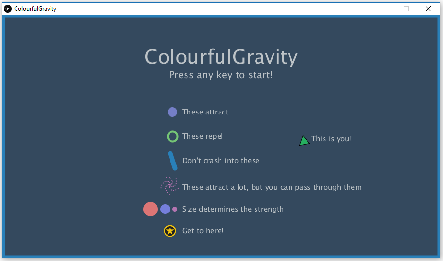
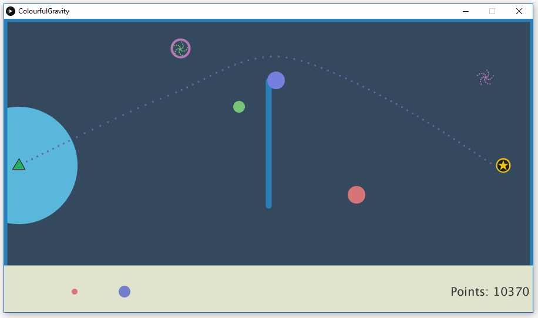
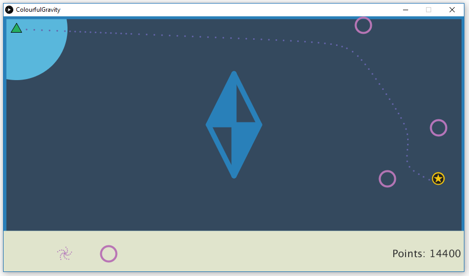

# ColourfulGravity

## About

In ColourfulGravity, your objective is to get your ship safely to the finish line. Sounds simple, right?
- **Well, it's not.** There's different kinds of obstacles on the map that you have to zip around. Sounds simple, right?
- **Again, it's not.** You can't control your ship, all you can do is push it off in a direction and let the gravities of the objects on the map control your ship. Sounds impossible, right?
- **Nope!** You're given your own set of objects that you can place to either work against the ones already placed or to control your ship in new ways.

We hope you have as much fun playing the game as we've had making it!

## Screenshots

## Features
- No game engine or framework used! We coded the game entirely in Processing. Gravity was calculated using Newton's Law of Universal Gravitation:  
- We've implemented a way to easily create levels, store the levels, and then read the levels back so people can share the levels they create. You can copy someone's *levels.txt* file to play their levels.
- We've also implemented a *guide line* that helps the player figure out where the ship is gonna end up. Note that if you click outside the blue circle, the ship will be launched at full power, where as if you click inside the circle, the ship will launch at a force relative to the distance from the ship to the mouse position.

## Background
We made this game for the Spring 2017 Game Jam hosted by the [Games Institute](https://uwaterloo.ca/games-institute) of the University of Waterloo. We basically created a design plan, designed the code base, established scope, and actually coded the project in under 36 hours.
[Rishabh Moudgil](http://github.com/FlapperDoodlez)
[Rob G. W. Nelson](http://github.com/smileyboy63)
[Dan Inglis](http://github.com/DanInglis)
Nathan Choi (Spiritual Guidance)

## Accolades
We're extremely proud of the fact that we won the award of **Most Fun Game** in the competition!
